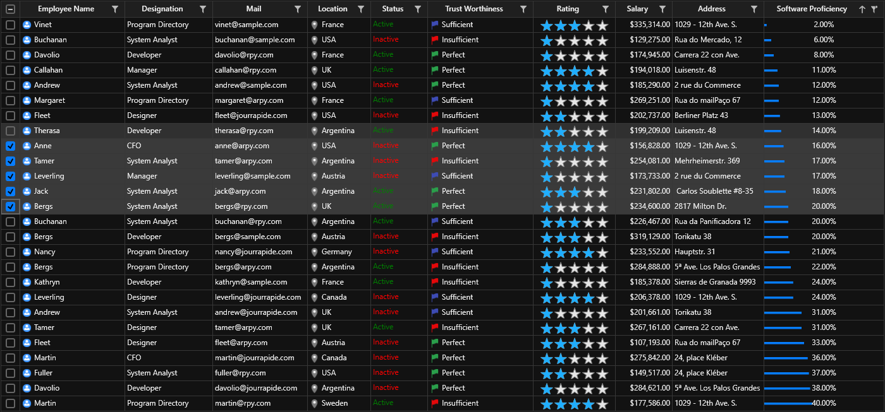

# How to customize material and office2019 themes using WPF Theme Studio application?

This sample holds the customized theme project assembly exported from ThemeStudio to load [Datagrid](https://help.syncfusion.com/wpf/datagrid/getting-started) and [Chromeless Window](https://help.syncfusion.com/wpf/chromeless-window/getting-started) with custom theme look using SkinManager [VisualStyle](https://help.syncfusion.com/wpf/themes/getting-started#apply-visual-style-to-controls) support.

