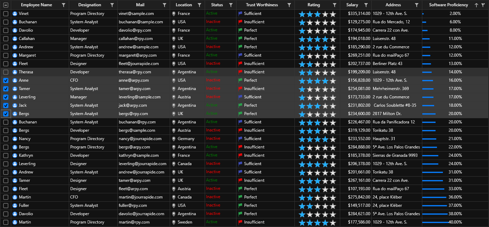

# How to customize material and office2019 themes using WPF Theme Studio application?

This sample demonstrates how to customize Material and Office2019 themes using the WPF Theme Studio application.

# Overview

The project contains a customized theme assembly exported from ThemeStudio, showcasing custom themes applied to:

* [Syncfusion DataGrid](https://help.syncfusion.com/wpf/datagrid/getting-started) - A powerful grid control with custom styling
* [Chromeless Window](https://help.syncfusion.com/wpf/chromeless-window/getting-started) - Modern borderless windows with custom appearance

The themes are loaded using SkinManager's [VisualStyle](https://help.syncfusion.com/wpf/themes/getting-started#apply-visual-style-to-controls) support for consistent application styling.

# Prerequisites

* Visual Studio 2019 or later
* .NET Framework 4.5 or higher / .NET 8.0+
* Syncfusion WPF controls (Essential Studio)
* WPF Theme Studio application

# Getting Started

1. Clone or download this repository
2. Open the solution in Visual Studio
3. Restore NuGet packages
4. Build and run the application

# Features

* Custom Material theme variants
* Custom Office2019 theme variants
* Pre-configured DataGrid with custom styling
* Chromeless Window implementation
* Easy theme switching via SkinManager

# Customization

Use WPF Theme Studio to:

* Modify color palettes
* Adjust control appearances
* Export custom theme assemblies
* Apply themes at runtime

